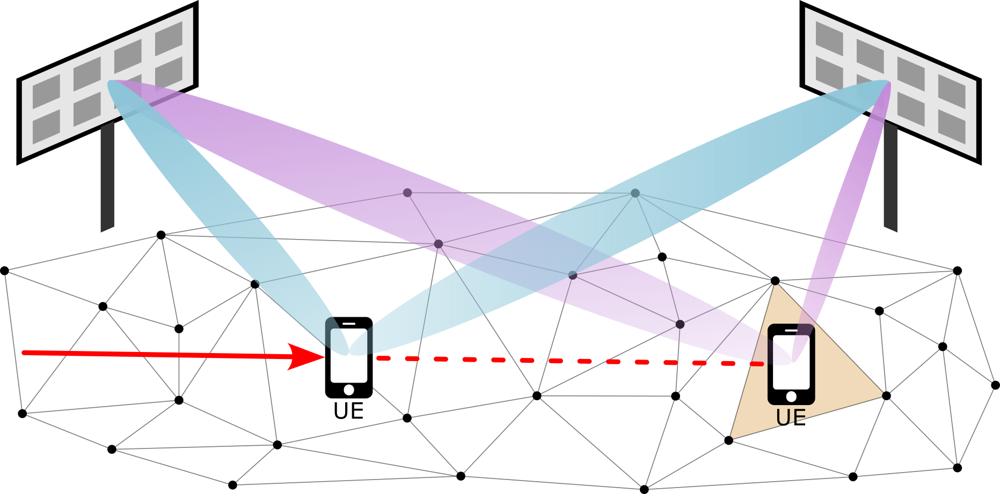

# Channel Charting-Based Channel Prediction on Real-World Distributed Massive MIMO CSI


This repository contains the source code for the results presented in the paper

> <a href="https://ieeexplore.ieee.org/abstract/document/10978279">Phillip Stephan, Florian Euchner, Stephan ten Brink: "Channel Charting-Based Channel Prediction on Real-World Distributed Massive MIMO CSI"</a>

presented at the 2025 IEEE Wireless Communications and Networking Conference (WCNC) in Milan, Italy.

* The [presentation slides](2025_WCNC_Presentation_Slides.pdf) can be found in this repository.
* A preprint is <a href="https://arxiv.org/abs/2410.11486">available on arXiv</a>.

## Summary



Although it is considered an important advancement for next-generation wireless systems, distributed massive MIMO suffers from decreasing data rates in user mobility scenarios due to channel aging.
Channel prediction aims to overcome this issue by predicting future channel state information (CSI) from past observations.
In the paper, we present a novel channel prediction method based on Channel Charting, a self-supervised method for learning a physically meaningful latent representation of the radio environment (the "channel chart") from similarity relationships within the CSI, which enables the prediction of future CSI due to its inherent inertia.
Demonstrated on a real-world distributed massive MIMO dataset measured with our [DICHASUS](https://dichasus.inue.uni-stuttgart.de/) channel sounder, Channel Charting-based channel prediction shows higher achievable sum rates for larger prediction horizons compared to a Wiener predictor and the outdated CSI.

## Prerequisites
Our code is based on Python, TensorFlow, NumPy, SciPy and Matplotlib.
Source files are provided as Jupyter Notebooks, which can be opened directly here on GitHub or using e.g. [JupyterLab](https://jupyter.org/).

We run our Channel Charting experiments on a JupyterHub server with NVMe storage, AMD EPYC 7262 8-Core Processor, 64GB RAM, and a NVIDIA GeForce RTX 4080 GPU for accelerating TensorFlow.
All indications of computation times are measured on this system.
It should also be possible to run our notebooks on less performant systems.

## How to Use the Code
The Jupyter Notebooks in this repository are numbered.
You must execute them in the right order.

* `0_DownloadDatasets.ipynb`: Download parts of the [dichasus-cf0x](https://dichasus.inue.uni-stuttgart.de/datasets/data/dichasus-cf0x/) dataset that we use for training and prediction. Due to the large file size, this dataset is not included in this git repository.
* `1_DataPreparation.ipynb`: Determine actual indices of datapoints based on their timestamps, as well as the respective indices used for training and prediction. Split Training Set and Prediction Set, and save them as `.npy` files.
* `2_ChannelCharting.ipynb`: Compute the fused dissimilarity matrix (angle delay profile + timestamp-based, learn more about this in [our tutorial](https://dichasus.inue.uni-stuttgart.de/tutorials/tutorial/dissimilarity-metric-channelcharting/)) and train the neural network that implements the forward charting function. Training is based on a Siamese neural network. With GPU acceleration, this should take a few minutes.
If you want to reproduce the results based on the same channel chart positions as in our paper, you can simply skip running this notebook, such that the channel chart positions that are stored in the `results` folder are used in the following notebooks. By running this notebook, the existing channel chart positions will be overwritten.
* `3_ChannelPrediction_ChannelCharting.ipynb`: Our Method -> Predict future CSI based on channel charting. Evaluation of the method with fixed prediction horizon.
* `4_ChannelPrediction_Wiener.ipynb`: Baseline Method -> Predict future CSI based on a Wiener predictor. Evaluation of the method with fixed prediction horizon.

## Citation

```
@inproceedings{10978279,
  author={Stephan, Phillip and Euchner, Florian and Brink, Stephan ten}, 
  title={{Channel Charting-Based Channel Prediction on Real-World Distributed Massive MIMO CSI}},
  booktitle={2025 IEEE Wireless Communications and Networking Conference (WCNC)},
  year={2025},
  pages={1-6},
  doi={10.1109/WCNC61545.2025.10978279}}
```

## Other Resources
* [Christoph Studer's Channel Charting Website](https://channelcharting.github.io/)
* [DICHASUS Website](https://dichasus.inue.uni-stuttgart.de/)
* [Our tutorial on dissimilarity metric-based Channel Charting](https://dichasus.inue.uni-stuttgart.de/tutorials/tutorial/dissimilarity-metric-channelcharting/)
* [Our paper on dissimilarity metric-based Channel Charting](https://arxiv.org/abs/2308.09539)
